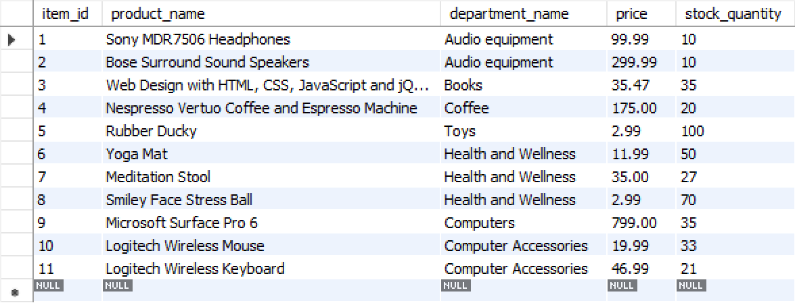
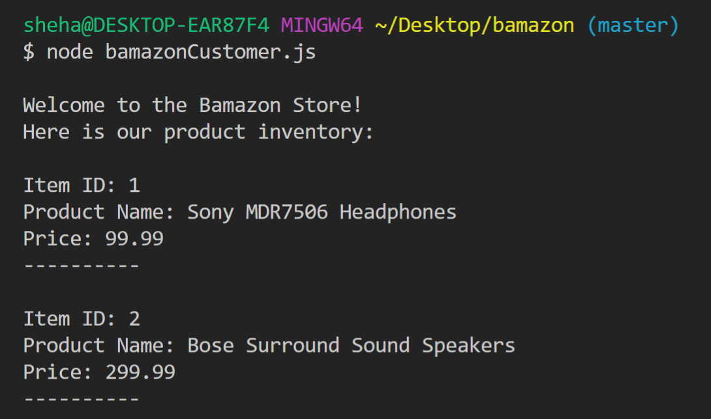
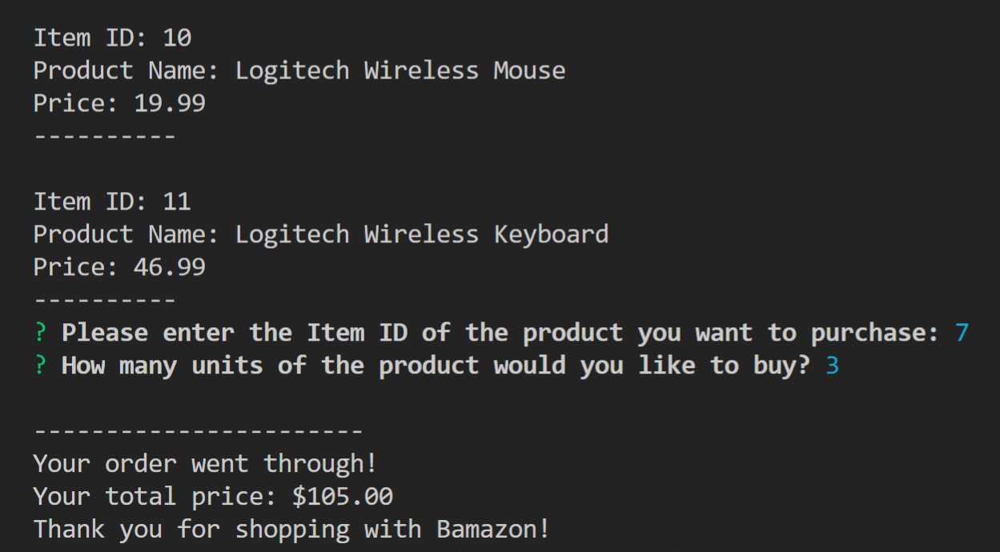

# Bamazon Storefront CLI App
A command-line app allowing the user to interact with the Bamazon store and purchase products.

## How to Use the Bamazon App

1. User opens directory in terminal and installs dependencies in package.json file
2. schema.sql file contains MySQL code to create product database; seeds.sql file contains code to populate data base with data.

3. User runs "node bamazonCustomer.js" in terminal and is greeted with a list of the inventory
based on the MySQL database.

4. User is prompted to enter the id of the product they want to buy and then the number of that product. If the product is in stock, the order goes through and the total price is displayed to user.

5. 

When the user runs the bamazonCustomer.js file in Node

